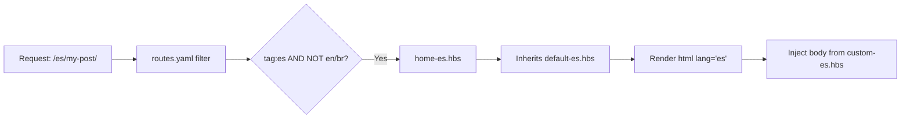

# SREDevOps.org Ghost Theme

> **Ghost v6 Theme** for [SREDevOps.org](https://www.sredevops.org) — Multi-locale, Tailwind CSS v3, responsive, dark-mode first, with SVG icons, sidebar navigation, and tag-based language filtering.

[](LICENSE)
[](https://ghost.org)
[](https://nodejs.org)

---

## 🌐 Multi-Locale Architecture

This theme implements a **template inheritance + tag-based routing strategy** to serve distinct content per locale without requiring separate Ghost instances. This approach aligns with community workarounds discussed in the [Ghost Forum](https://forum.ghost.org/t/different-locales-with-different-content/62836).

### Template Inheritance Pattern

```
┌─────────────────────────────────────┐
│ routes.yaml                          │
│ • /en/* → home-en.hbs               │
│ • /es/* → home-es.hbs               │
│ • /br/* → home-br.hbs               │
└─────────┬───────────────────────────┘
          │
          ▼
┌─────────────────────────────────────┐
│ home-*.hbs (collection template)    │
│ • Defines collection query/filter   │
│ • Renders post list via partials    │
│ • {{!< default-*.hbs}} inheritance  │
└─────────┬───────────────────────────┘
          │
          ▼
┌─────────────────────────────────────┐
│ custom-*.hbs (post/page template)   │
│ • Locale-specific post layout       │
│ • Localized metadata, TOC, comments │
│ • {{!< default-*.hbs}} inheritance  │
└─────────┬───────────────────────────┘
          │
          ▼
┌─────────────────────────────────────┐
│ default-*.hbs (layout shell)        │
│ • <html lang="*"> attribute         │
│ • Common <head>, assets, footer     │
│ • {{{body}}} injection point        │
└─────────────────────────────────────┘
```

> 💡 **Key Insight**: Each locale uses its own `default-*.hbs` layout shell to ensure proper `lang` attributes, meta tags, and localized UI strings. The `{{{body}}}` Handlebars placeholder in `default-*.hbs` receives the rendered output from `custom-*.hbs` or `home-*.hbs`.

### Language Routing & Tag Filtering

| Locale | URL Pattern | Required Tags | Exclusion Tags | Layout Shell |
|--------|-------------|---------------|----------------|--------------|
| **English (default)** | `/` or `/en/{slug}/` | `en`, `hash-en` | `-es`, `-br` | `default.hbs` |
| **Spanish** | `/es/{slug}/` | `es`, `hash-es` | `-en`, `-br` | `default-es.hbs` |
| **Portuguese (BR)** | `/br/{slug}/` | `br`, `hash-br` | `-en`, `-es` | `default-br.hbs` |

> ⚠️ **Critical**: The **default locale (English)** is configured in **Ghost Admin → Settings → General → Publication language**. All root-level routes (`/`, `/page/2/`, etc.) serve English content unless explicitly routed otherwise.

### `routes.yaml` Core Configuration

```yaml
collections:
  /es/:
    template: home-es
    permalink: /es/{slug}/
    filter: tag:es+tag:-en+tag:-br
    data: tag.es

  /en/:
    template: home-en
    permalink: /en/{slug}/
    filter: tag:en+tag:-es+tag:-br
    data: tag.en

  /br/:
    template: home-br
    permalink: /br/{slug}/
    filter: tag:br+tag:-es+tag:-en
    data: tag.br

# Fallback: English as default locale (configured in Ghost Admin)
taxonomies:
  tag: /tag/{slug}/
  author: /author/{slug}/
```

✅ **Why this works**: Ghost's `filter` syntax supports boolean logic (`+` for AND, `-` for NOT), enabling precise content segregation per locale while maintaining a single content database. The `template` directive ensures each collection uses its locale-specific layout chain.

---

## 📋 Table of Contents

- [Prerequisites](#-prerequisites)
- [Installation](#-installation)
- [Development Workflow](#-development-workflow)
- [Locale Content Authoring](#-locale-content-authoring)
- [Template Architecture](#-template-architecture)
- [Theme Configuration](#-theme-configuration)
- [Testing & Validation](#-testing--validation)
- [Deployment](#-deployment)
- [Contributing](#-contributing)
- [License](#-license)

---

## 🔧 Prerequisites

| Dependency | Version | Purpose |
|------------|---------|---------|
| **Node.js** | `>=22` | Runtime for build tooling |
| **Yarn** | `>=1.22` | Package management (preferred over npm) |
| **Ghost** | `>=6.0` | Local development server |
| **Docker** *(optional)* | Latest | Run Ghost via official container |

> 🐳 **Ghost Local Setup**: Follow the [official Docker guide](https://docs.ghost.org/install/docker/) for a reproducible dev environment.

---

## 🚀 Installation

### 1. Clone & Install

```bash
# Clone the repository
git clone https://github.com/sredevopsorg/sredevopsorg-ghost-theme.git
cd sredevopsorg-ghost-theme

# Install dependencies (Yarn required)
yarn install
```

### 2. Configure Ghost

1. Start your local Ghost instance:

   ```bash
   # If using Docker Compose (recommended)
   docker compose up -d
   
   # Or via Ghost-CLI
   ghost start
   ```

2. Upload `routes.yaml` to **Ghost Admin → Settings → Routing**

3. Upload the theme:
   - Via Admin: **Settings → Design → Upload theme**
   - Or symlink for development:

     ```bash
     ln -s /path/to/sredevopsorg-ghost-theme \
       /path/to/ghost/content/themes/sredevopsorg-ghost-theme
     ```

4. **Critical**: Set your default locale in **Ghost Admin → Settings → General → Publication language** (e.g., `en` for English). This determines which templates serve root-level routes.

5. Activate the theme in **Ghost Admin → Design**

### 3. Start Development Server

```bash
yarn dev
```

This triggers:

- Tailwind CSS compilation with `@tailwindcss/forms` and `@tailwindcss/typography`
- Asset bundling via Gulp
- LiveReload for template/CSS changes

> 🔁 **Hot reload** is enabled for `.hbs`, `.css`, and `.js` files. Browser refreshes automatically on save.

---

## ✍️ Locale Content Authoring

### Tagging Posts for Language Filtering

When creating content in Ghost Admin or via Markdown import:

```md
---
title: "My Post Title"
slug: "my-post-slug"
tags:
  - en          # Primary language slug (required)
  - hash-en     # Required for filter consistency
  - Kubernetes  # Topic tags
  - SRE
---

```

⚠️ **Critical**: Omitting either `en`/`es`/`br` **or** its `hash-*` counterpart will cause the post to not appear in locale-specific collections due to the `filter` logic in `routes.yaml`.


### Template Resolution Flow



### Creating Locale-Specific Templates

1. **Copy the base template**:

   ```bash
   cp default.hbs default-es.hbs
   cp custom.hbs custom-es.hbs
   cp home.hbs home-es.hbs
   ```

2. **Update the layout shell** (`default-es.hbs`):

   ```handlebars
   <!DOCTYPE html>
   <html lang="es"> {{!-- Critical for SEO/accessibility --}}
   <head>
     <meta charset="utf-8">
     <title>{{meta_title}}</title>
     {{!-- Spanish-specific OG tags --}}
     <meta property="og:locale" content="es_CL">
     {{ghost_head}}
   </head>
   <body class="{{body_class}}">
     {{>"components/nav-es"}} {{!-- Optional: localized nav --}}
     {{{body}}} {{!-- Injects custom-es.hbs content --}}
     {{>"components/footer"}}
   </body>
   </html>
   ```

3. **Customize content templates** (`custom-es.hbs`):
   - Localize UI strings ("Autor", "Publicado", "Índice")
   - Adjust date formats (`{{date published_at format="DD MMM YYYY"}}`)
   - Conditionally render locale-specific components

---

## 🏗️ Template Architecture Reference

| File | Role | Inheritance | Locale Scope |
|------|------|-------------|--------------|
| `default.hbs` | Base HTML shell for English | None (root) | English (default) |
| `default-es.hbs` | Base HTML shell for Spanish | None (root) | Spanish |
| `default-br.hbs` | Base HTML shell for Portuguese | None (root) | Portuguese (BR) |
| `custom.hbs` | Post/page content layout | `{{!< default}}` | English |
| `custom-es.hbs` | Post/page content layout | `{{!< default-es}}` | Spanish |
| `home.hbs` | Collection/listing template | `{{!< default}}` | English |
| `home-es.hbs` | Collection/listing template | `{{!< default-es}}` | Spanish |
| `post-card-es.hbs` | Post preview partial | Standalone | Spanish |

> 🔄 **Inheritance Syntax**: `{{!< filename}}` at the top of a template tells Ghost: *"Render this file's content inside the `{{{body}}}` placeholder of `filename`"*.

---

## ⚙️ Theme Configuration

Customize behavior via **Ghost Admin → Settings → Theme**:

| Option | Type | Default | Description |
|--------|------|---------|-------------|
| `background_color` | Color | `#0f172a` | Base background for dark theme |
| `lazy_images` | Boolean | `false` | Enable native lazy-loading on homepage |
| `share_buttons` | Boolean | `true` | Show social share UI on posts |
| `show_langs` | Boolean | `false` | Display language switcher in sidebar |
| `show_sso` | Boolean | `false` | Show SSO login option in sidebar |

### Image Size Presets

Configured in `package.json` → `config.image_sizes`:

```json
"image_sizes": {
  "xs": { "width": 100 },
  "s":  { "width": 220 },
  "m":  { "width": 300 },
  "l":  { "width": 600 },
  "xl": { "width": 900 }
}
```

Use in templates: `{{img_url feature_image size="l"}}`

---

## 🧪 Testing & Validation

### Local Testing

```bash
# Build production assets
yarn build

# Validate theme against Ghost spec
yarn test:dev    # Verbose output
yarn test:ci     # Fail on warnings (for CI)
```

### Locale-Specific Validation

```bash
# Test Spanish routing locally
curl -I http://localhost:2368/es/ | grep "lang"
# Expected: <html lang="es">

```

### Lighthouse Audits

The theme targets:

- ✅ Performance ≥ 90 (with lazy loading enabled)
- ✅ Accessibility ≥ 95 (proper `lang` attributes per locale)
- ✅ SEO ≥ 100 (with localized meta tags and hreflang)

Run via Chrome DevTools

---

## 🚢 Deployment

### Option 1: Ghost Admin Upload

1. Build assets:

   ```bash
   yarn build
   ```

2. Zip the theme:

   ```bash
   zip -r sredevopsorg-ghost-theme.zip . \
     -x "*.git*" "node_modules/*" ".github/*"
   ```

3. Upload via **Ghost Admin → Design → Upload theme**

### Option 2: GitHub Actions (Recommended)

This repo includes a [Deploy Ghost Theme Action](.github/workflows/deploy.yml) that:

- Builds assets on push to `main`
- Deploys via Ghost Admin API
- Supports environment-specific config (staging/prod)

Configure secrets:

- `GHOST_ADMIN_API_URL`
- `GHOST_ADMIN_API_KEY`

---

## 🤝 Contributing

We welcome contributions aligned with our [Code of Conduct](CODE_OF_CONDUCT.md).

### Development Guidelines

- **Branching**: Use feature branches (`feat/locale-switcher`, `fix/og-tags-es`)
- **Commits**: Follow [Conventional Commits](https://www.conventionalcommits.org/)
- **PRs**: Include screenshots for UI changes; update README if behavior changes
- **Testing**: Run `yarn test:ci` before submitting

### Adding a New Locale (e.g., `pt` for Portugal)

1. **Create layout shell**:

   ```bash
   cp default.hbs default-pt.hbs
   # Edit: <html lang="pt">, OG locale, localized strings
   ```

2. **Create content templates**:

   ```bash
   cp custom.hbs custom-pt.hbs
   cp home.hbs home-pt.hbs
   # Localize UI text, date formats, component partials
   ```

3. **Update `routes.yaml`**:

   ```yaml
   /pt/:
     template: home-pt
     permalink: /pt/{slug}/
     filter: tag:pt+tag:-en+tag:-es+tag:-br
     data: tag.pt
   ```

4. **Update documentation**:
   - Add row to the [Language Routing table](#language-routing--tag-filtering)
   - Document any locale-specific partials (e.g., `nav-pt.hbs`)

5. **Test thoroughly**:
   - Verify `lang="pt"` in rendered HTML
   - Confirm tag filtering excludes other locales
   - Validate SEO meta tags with `og:locale="pt_PT"`

---

## 📜 License

- **Code**: [MIT License](LICENSE) — use, modify, distribute freely
- **Content**: CC BY 4.0 (for SREDevOps.org editorial content)
- **Third-party assets**: Respect upstream licenses (Tailwind CSS: MIT, Ghost: MIT)

---

## 🙏 Credits

- **Author**: Nicolás Georger ([@ngeorger](https://github.com/ngeorger)) — SRE/DevOps practitioner, Santiago, Chile
- **Inspiration**:
  - [Priority Vision's "Aspect" Theme](https://priority.vision)
  - [@TryGhost "Source" Theme](https://github.com/TryGhost/Source)
- **Community**: Ghost Forum contributors for multi-locale pattern validation
- **Tooling**: Tailwind CSS, Gulp, PostCSS, GScan

---

> 🌎 **LatAm Note**: This theme was built with LatAm infrastructure constraints in mind — minimal external dependencies, optimized asset delivery, and community-driven localization patterns. For questions about deploying in Chile/Argentina/Brazil contexts, open an issue or reach out via [SREDevOps.org](https://www.sredevops.org).

*Last updated: May 2026 | Ghost v6 compatible*
