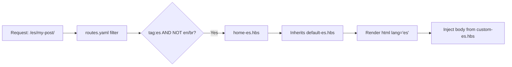

# SREDevOps.org Ghost Theme (v3)

> **Ghost 6 theme** for [SREDevOps.org](https://www.sredevops.org) — multi-locale, Tailwind CSS v4 built with Vite, React islands where interactivity is needed, light and dark palettes, and tag-based language filtering. Makes no third-party requests.

[](LICENSE)
[](https://ghost.org)
[](https://nodejs.org)
[](https://deepwiki.com/sredevopsorg/sredevopsorg-ghost-theme)
---

## 🌐 Multi-Locale Architecture

This theme implements a **template inheritance + tag-based routing strategy** to serve distinct content per locale without requiring separate Ghost instances. This approach aligns with community workarounds discussed in the [Ghost Forum](https://forum.ghost.org/t/different-locales-with-different-content/62836).

### Template Inheritance Pattern

```
┌─────────────────────────────────────┐
│ routes.yaml                          │
│ • /en/* → home-en.hbs               │
│ • /es/* → home-es.hbs               │
│ • /br/* → home-br.hbs               │
└─────────┬───────────────────────────┘
          │
          ▼
┌─────────────────────────────────────┐
│ home-*.hbs (collection template)    │
│ • Defines collection query/filter   │
│ • Renders post list via partials    │
│ • {{!< default-*.hbs}} inheritance  │
└─────────┬───────────────────────────┘
          │
          ▼
┌─────────────────────────────────────┐
│ custom-*.hbs (post/page template)   │
│ • Locale-specific post layout       │
│ • Localized metadata, TOC, comments │
│ • {{!< default-*.hbs}} inheritance  │
└─────────┬───────────────────────────┘
          │
          ▼
┌─────────────────────────────────────┐
│ default-*.hbs (layout shell)        │
│ • <html lang="*"> attribute         │
│ • Common <head>, assets, footer     │
│ • {{{body}}} injection point        │
└─────────────────────────────────────┘
```

> 💡 **Key Insight**: Each locale uses its own `default-*.hbs` layout shell to ensure proper `lang` attributes, meta tags, and localized UI strings. The `{{{body}}}` Handlebars placeholder in `default-*.hbs` receives the rendered output from `custom-*.hbs` or `home-*.hbs`.

### Language Routing & Tag Filtering

| Locale | URL Pattern | Required Tags | Exclusion Tags | Layout Shell |
| -------- | ------------- | --------------- | ---------------- | -------------- |
| **English (default)** | `/` or `/en/{slug}/` | `en`, `hash-en` | `-es`, `-br` | `default.hbs` |
| **Spanish** | `/es/{slug}/` | `es`, `hash-es` | `-en`, `-br` | `default-es.hbs` |
| **Portuguese (BR)** | `/br/{slug}/` | `br`, `hash-br` | `-en`, `-es` | `default-br.hbs` |

> ⚠️ **Critical**: The **default locale (English)** is configured in **Ghost Admin → Settings → General → Publication language**. All root-level routes (`/`, `/page/2/`, etc.) serve English content unless explicitly routed otherwise.

### `routes.yaml` Core Configuration

```yaml
collections:
  /es/:
    template: home-es
    permalink: /es/{slug}/
    filter: tag:es+tag:-en+tag:-br
    data: tag.es

  /en/:
    template: home-en
    permalink: /en/{slug}/
    filter: tag:en+tag:-es+tag:-br
    data: tag.en

  /br/:
    template: home-br
    permalink: /br/{slug}/
    filter: tag:br+tag:-es+tag:-en
    data: tag.br

# Fallback: English as default locale (configured in Ghost Admin)
taxonomies:
  tag: /tag/{slug}/
  author: /author/{slug}/
```

✅ **Why this works**: Ghost's `filter` syntax supports boolean logic (`+` for AND, `-` for NOT), enabling precise content segregation per locale while maintaining a single content database. The `template` directive ensures each collection uses its locale-specific layout chain.

---

## 📋 Table of Contents

- [Prerequisites](#-prerequisites)
- [Installation](#-installation)
- [Development Workflow](#-development-workflow)
- [Islands](#-islands-client-interactivity)
- [Security feed widget](#-security-feed-widget)
- [Locale Content Authoring](#-locale-content-authoring)
- [Template Architecture](#-template-architecture)
- [Theme Configuration](#-theme-configuration)
- [Testing & Validation](#-testing--validation)
- [Deployment](#-deployment)
- [Contributing](#-contributing)
- [License](#-license)

---

## 🔧 Prerequisites

| Dependency | Version | Purpose |
|------------|---------|---------|
| **Node.js** | `>=24` | Runtime for build tooling (Vite 7, Tailwind v4) |
| **Yarn** | `>=1.22` | Package management (preferred over npm) |
| **Ghost** | `>=6.0` | Local development server |
| **Docker** *(optional)* | Latest | Run Ghost via official container |

> 🐳 **Ghost Local Setup**: Follow the [official Docker guide](https://docs.ghost.org/install/docker/) for a reproducible dev environment.

---

## 🚀 Installation

### 1. Clone & Install

```bash
# Clone the repository
git clone https://github.com/sredevopsorg/sredevopsorg-ghost-theme.git
cd sredevopsorg-ghost-theme

# Install dependencies (Yarn required)
yarn install
```

### 2. Configure Ghost

1. Start your local Ghost instance:

   ```bash
   # If using Docker Compose (recommended)
   docker compose up -d
   
   # Or via Ghost-CLI
   ghost start
   ```

2. Upload `routes.yaml` to **Ghost Admin → Settings → Routing**

3. Upload the theme:
   - Via Admin: **Settings → Design → Upload theme**
   - Or symlink for development:

     ```bash
     ln -s /path/to/sredevopsorg-ghost-theme \
       /path/to/ghost/content/themes/sredevopsorg-ghost-theme
     ```

4. **Critical**: Set your default locale in **Ghost Admin → Settings → General → Publication language** (e.g., `en` for English). This determines which templates serve root-level routes.

5. Activate the theme in **Ghost Admin → Design**

### 3. Start Development Server

```bash
yarn dev        # vite build --watch: rebuilds assets/built/** on save
```

This rebuilds, on every change:

- `assets/css/index.css` (Tailwind CSS v4 + `assets/css/theme.css`) → `assets/built/index-<hash>.css`
- `assets/js/index.js` → `assets/built/index-<hash>.js`
- `partials/vite_assets/{head,foot}.hbs`, regenerated from `assets/built/manifest.json`

Because filenames are hashed, the generated partials are the only place asset URLs live —
never hardcode them, and rebuild after pulling.

> 🔁 **Dev loop:** `yarn build` (or `--watch`) for assets, but **Ghost caches compiled
> Handlebars templates** — after editing any `.hbs` file run `yarn ghost:restart`
> (or `ghost restart`) before trusting what the browser shows.
> `yarn ghost:up` starts a local Ghost 6 at <http://localhost:2368> with this repo mounted
> as the active theme; see [tests/fixtures/README.md](tests/fixtures/README.md).

---

## 🧩 Islands (client interactivity)

Ghost renders every page server-side; React is added only where a template declares a mount
point. Nothing may break with JavaScript disabled.

```handlebars
{{!-- post.hbs --}}
<div data-island="ReadingProgress" data-target=".gh-content"></div>
```

```jsx
// assets/js/islands/ReadingProgress.jsx — owns dynamic UI, renders into the element
export function mount(element, props) {
  createRoot(element).render(<ReadingProgress {...props} />);
}
```

```js
// assets/js/islands/MobileMenu.js — augments server markup, loads no framework
export function enhance(element, props) {
  // element is the <details> from the template; it keeps its children
  return () => {}; // optional cleanup
}
```

Pick the cheapest mode that does the job: `enhance` for DOM augmentation (the mobile menu
costs 0.47 kB gzip), `mount` when the island really owns stateful UI (React is ~69 kB gzip,
so it is code-split and only fetched where such an island exists).

1. Register the module in `assets/js/islands.js` — the key must equal `data-island`.
2. `yarn build`, then `yarn ghost:restart` (Ghost caches compiled templates).
3. `yarn verify` — the checks below fail loudly if the wiring is wrong.

| Guarantee | Enforced by |
| --- | --- |
| No page eager-loads React; the framework arrives with the island that needs it | `yarn test:bundle` (entry has no framework, partials reference only the entry) |
| Every `data-island` in a template resolves to a code-split chunk | `yarn test:bundle` |
| Island Tailwind classes have real CSS | `yarn test:classes` |
| `enhance` island behaviour (Escape, outside click, breakpoints) | `yarn test:unit` |
| Island chunks load and expose exactly one of `mount`/`enhance` | `yarn test:bundle` |
| Below-the-fold islands (`data-island-lazy`) are not fetched early | mount points `[data-island-lazy]`, observed with `IntersectionObserver` |
| Adding an island cannot break the page or the other islands | guarded, isolated mounting in `assets/js/islands.js` |

Strings come from `partials/island-config.hbs` (`{{json}}` + `{{t}}`), read in an island with
`t("key")` from `assets/js/lib/theme-config.js`. Keep that payload small: it is inline on every
page.

---

## 🛡️ Security feed widget

The theme can render the newest advisories from
[SREDevOps Sec Feed](https://github.com/sredevopsorg/sredevopsorg-sec-feed) — Ubuntu, Debian,
Red Hat, NVD, CISA, AWS, the Kubernetes blog and OpenSSF, enriched with CISA KEV, EPSS and
OSV.dev — as a block **inside** a page, above the post grid on every collection.

It is a *minified* frontend on purpose. The service already ships a full single-page
frontend with search, SSE and its own filters; this is the small half of it, and the
widget's footer links to the real thing.

```
Ghost renders                         the island fetches
─────────────                         ────────────────
partials/featured-row.hbs             assets/js/islands/SecFeed.js
  ┌─ 2/3 ────────────┬─ 1/3 ─────┐     status line, tag chips, rows
  │ featured post    │ sec feed   │ ──► poll every 5 min while visible
  │                 │ <section>  │ ──► GET {base}/api/feed?limit=10
  └──────────────────┴────────────┘     <noscript> link if JavaScript is off
```

### Turning it on

**Admin → Settings → Design → Theme**

| Option | Type | Default | Description |
|--------|------|---------|-------------|
| `sec_feed_api_url` | Text | *(empty)* | Origin of the feed API, e.g. `https://security-feed.sredevops.org`. Empty hides the widget entirely. |
| `sec_feed_items` | Select | `10` | How many advisories the widget shows (5 / 10 / 15 / 20). |

With `sec_feed_api_url` empty the partial renders **nothing**: no markup, no island chunk,
no request. That keeps "the theme makes no third-party requests" true for an unmodified
site, and it is what `tests/sec-feed.test.mjs` guards — the API origin appears in no source
file, only as this setting.

### ⚠️ CORS is required — and it is not configured yet

The widget calls the feed **cross-origin**, and the sec-feed fails CORS closed: with
`CORS_ORIGINS` unset, no cross-origin caller is allowed. Add the publication's origin to
the service:

```
CORS_ORIGINS=https://www.sredevops.org
```

Checked against the live service on 2026-10-03: `GET /api/feed` sent with an `Origin`
header returns `200` and `Vary: Origin`, but **no `Access-Control-Allow-Origin`** — so until
`CORS_ORIGINS` includes the publication, the browser blocks the response and the widget
shows its error state (correctly: it degrades, it does not break the page). To avoid CORS
entirely, reverse-proxy the feed onto the publication's own domain and set
`sec_feed_api_url` to that path, e.g. `/feed`.

### Behaviour worth knowing

- **Polling, not SSE.** `/api/events` is rate-limited and caps concurrent subscribers, so a
  widget on a public homepage should not hold one connection per open tab. It polls every 5
  minutes while the tab is visible and refreshes when the tab returns or the browser
  reconnects.
- **Failures degrade.** A failed first load renders a message and a retry button; a failed
  later poll keeps the rows and marks them stale instead of blanking the page.
- **Sample rows are labelled.** When no upstream source is reachable the service serves
  realistic sample items; the widget says so rather than passing it off as live data.
- **No-JS** shows a link to the full feed (`<noscript>`, outside the mount point).
- **Tag chips filter the rows already fetched** — no request per click, no rate limit spent.

### Where it appears

Included by `partials/featured-row.hbs`, which the four **channel** templates reach through
`collection-layout.hbs`: `/` (or `/en/`), `/es/` and `/br/`. It sits in a **1/3 column beside
the featured post, which takes the other 2/3**, and stacks below it on mobile (the post is
first in the DOM, so it also reads first without CSS).

When `sec_feed_api_url` is empty, `featured-row.hbs` renders the bare full-width featured post
and no grid at all — an unconfigured site's HTML is byte-identical to a theme without this
feature. If a channel has **no** featured post configured, the 2/3 column is empty and the feed
sits beside it; a site with no featured post on a channel would want the feed moved.

### Height and scrolling

**The feed panel is the same height as the featured card, and leaves the same space below it.**
The advisory list is the scroll region — the heading, the status line and the tag chips stay
pinned above it — so a channel with twenty advisories is exactly as tall as one with three.

The featured card carries `mb-12`, so the row's rhythm is *card + 48px*. The feed column repeats
that same `mb-12` (`partials/featured-row.hbs`), and the panel is pinned to what is left. That is
what makes the two visible surfaces line up: the panel is shortened by the margin to the card's
height, and the margin is the space the row needs before the post grid. Two mechanisms are at
work, and both matter:

| Mechanism | Where | Why |
| --- | --- | --- |
| `align-items: stretch` (the grid default) | `partials/featured-row.hbs` row | gives both columns the row's height instead of their own |
| `lg:relative` column + `lg:absolute lg:inset-0` panel | row / `partials/sec-feed.hbs` | takes the feed out of the row's intrinsic sizing, so the *hero card* decides the height |
| `mb-12` on the feed column | `partials/featured-row.hbs` | matches the card's own bottom margin, so the panel is the card's height and the next block keeps the same gap |

Without the second row of that table the height is merely *equal*, not stable: an in-flow grid
item still contributes its content height to an auto-sized row track, so a feed of twenty
advisories sized the track no matter how the column was clamped (`min-h-0` bounds a flex item,
not a grid track). Without the third, the panel is one card-margin taller than the card and sits
flush against the post grid. A hardcoded row height cannot replace any of it: the card measures
504.5px at 1024x900 and 467px at every width from 1280 up, so any constant is wrong at one end.

Measured in Chromium against a live feed:

| Viewport | Featured card | Feed panel | Gap below card | Gap below panel | List scrollable |
| --- | --- | --- | --- | --- | --- |
| 1024×900 | 504.5 | 504.5 | 48px | 48px | 272px |
| 1280×900 | 467.0 | 467.0 | 48px | 48px | 235px |
| 1440×900 | 467.0 | 467.0 | 48px | 48px | 235px |
| 1920×1080 | 467.0 | 467.0 | 48px | 48px | 235px |

With **20** advisories the panel is still 467.0px and only the list grows — before this change
the block grew with every advisory added.

**On mobile the columns stack and are deliberately not equalised.** Below `lg` the panel is an
ordinary in-flow block, so the feed sits *below* the hero at its own height (measured: 615.8px of
hero, then 764.5px of feed). Bounding it there would nest a scrollbar inside the page's own and
trap touch scrolling, so it is left alone. "Same height as the 2/3 element" is a side-by-side
property; there is no 2/3 element once the columns stack.

It is *not* on post templates and *not* on `/tag/…` or `/author/…` — `tag.hbs` and `author.hbs`
carry their own markup rather than sharing `collection-layout.hbs`.

The block is one partial, so anywhere else it goes where you put it:

```handlebars
{{> "sec-feed" locale=locale}}
```

Verified against a local Ghost 6: the block renders with the expected `data-*` attributes,
`/es/` gets the Spanish heading and no-JS link from the locale passed through, and no post,
page, tag or author template gains any widget markup.

### Full-page feed (`page-secfeed.hbs`)

`page-secfeed.hbs` renders the same block as a page rather than a sidebar. Ghost resolves a
page's template as `page-:slug.hbs` → `custom-*.hbs` → `page.hbs`, so it applies automatically
to a page whose **slug is `secfeed`** — create one and the feed is there, no template setting to
change. The page's own title and excerpt render above it, respecting the editor's
"show title and feature image" toggle.

```handlebars
{{> "sec-feed" locale="en" full=true}}
```

`full=true` changes three things, and they are not cosmetic:

| | Embedded (default) | Full page (`full=true`) |
| --- | --- | --- |
| Frame | `lg:absolute lg:inset-0 h-full min-h-0 flex flex-col overflow-hidden` | an ordinary in-flow card |
| What scrolls | the list, inside the panel | the document |
| How many advisories | the `sec_feed_items` setting | 25, the API maximum (`MAX_LIMIT`) |

The mode exists because the embedded layout's contract is *relative to a bounded box*: the list
is `flex: 1 1 0%` with `min-height: 0`, which resolves against the panel the partial is pinned
into. In an auto-height box the zero basis would win and the list would collapse to nothing while
scrolling inside its own frame. So `full=true` also sets `data-fill="page"` on the mount point,
and `assets/js/islands/SecFeed.js` skips the flex/overflow layout entirely — the status line, the
filter chips and the rows stay in normal flow and the page scrolls.

Measured in Chromium (`/secfeed/`, 25 advisories): the panel is 2634.5px tall, the list has
`overflow-y: visible` and `clientHeight == scrollHeight` (no nested scrollbar), and the document
scrolls. The embedded homepage panel on the same run is still 467px with `overflow-y: auto` and
a `clientHeight` of 255 against a 532px list — the two modes do not interfere.

For a Spanish or Portuguese feed page, add a file like this one extending `default-es.hbs` /
`default-br.hbs` and pass the matching `locale`, the same remedy `custom-page-es.hbs` documents.

### Weight

The island is **3.87 kB gzip and loads no framework**, versus ~69 kB gzip for the React runtime
the other islands share. That is why this one is vanilla while `ReadingProgress` and
`TableOfContents` are React: there is no server-rendered content here to hydrate, and this is
likely to sit on the homepage. The decisions worth testing live in
`assets/js/lib/sec-feed-model.js` and are unit-tested there; see
[docs/adr/0003](docs/adr/0003-security-feed-widget.md) for the reasoning.

---

### Self-hosted assets (no third-party requests)

The theme makes **no third-party requests**. Fonts and icons ship with it, so there is no
extra DNS lookup, no second TLS handshake and nothing render-blocking from another origin.

| Asset | Where it comes from | How to refresh |
| --- | --- | --- |
| Inter, Roboto Mono | `assets/fonts/*.woff2` (latin + latin-ext) | `node scripts/sync-fonts.mjs` |
| Icons | `partials/icon.hbs`, inline SVG | `node scripts/sync-icons.mjs` |

Both scripts are run by hand, not by the build: they download from Google Fonts and
jsDelivr respectively and rewrite committed files, so a build stays offline and
reproducible. `assets/css/fonts.css` is generated by the font script — edit the script,
not the CSS. Licence texts live next to what they cover (`assets/fonts/LICENSE-*`,
`assets/licenses/`), which is what OFL and MIT require.

Icons are inline SVG rather than an icon font: they render with the first paint instead of
waiting for a webfont, they inherit colour through `currentColor`, and the theme no longer
pays for a stylesheet describing glyphs it never uses. Call them as
`{{> "icon" name="clock" class="w-3 h-3 mr-1"}}` — the size is explicit because an SVG has
no font-size, and `class` defaults to `w-4 h-4`.

`tests/no-third-party.test.mjs` fails the build if a third-party host or a Font Awesome
class comes back.

## 🎨 Theming

The palette is **dark by default**, and light once the reader chooses it. The operating
system's preference is not consulted; nothing has to be configured.

**Tokens are named by role, never by colour** — `bg-surface`, `text-muted`,
`border-border-strong` — so a palette is a list of values rather than a rewrite of every
template. Each token is one `light-dark(light, dark)` pair, and `color-scheme` decides
which half applies: `data-theme` on `<html>` when the reader has chosen, the dark default
otherwise.

```css
:root { color-scheme: dark; }                     /* the default */
:root[data-theme="light"] { color-scheme: light; } /* explicit choice */
:root[data-theme="dark"] { color-scheme: dark; }

@theme {
  --color-surface: light-dark(#ffffff, #0d0e11);
  --color-strong:  light-dark(#111827, #f3f4f6);
}
```

`{{> "icon" name="sun"}}` / `{{> "icon" name="moon"}}` inside `.theme-toggle` are both
rendered and CSS shows the one matching the current theme, so the control is correct
before any script runs. The `ThemeToggle` island only labels the button and writes the
choice; a small inline script in `partials/head.hbs` applies a stored choice before the
first paint, which is the one thing a deferred module cannot do.

`light-dark()` requires Chrome 111+, Safari 16.4+ or Firefox 120-era browsers — no more
than Tailwind v4 already asks for. Adding a locale or a palette means editing the token
block in `assets/css/index.css`, not the templates. See
[docs/adr/0002](docs/adr/0002-theming-semantic-tokens.md).

## ✍️ Locale Content Authoring

### Tagging Posts for Language Filtering

When creating content in Ghost Admin or via Markdown import:

```md
---
title: "My Post Title"
slug: "my-post-slug"
tags:
  - en          # Primary language slug (required)
  - hash-en     # Required for filter consistency
  - Kubernetes  # Topic tags
  - SRE
---

```

⚠️ **Critical**: Omitting either `en`/`es`/`br` **or** its `hash-*` counterpart will cause the post to not appear in locale-specific collections due to the `filter` logic in `routes.yaml`.

⚠️ **Also required for the document language**: a post in a locale collection must be
assigned that locale's template — `custom-es` or `custom-es` for Spanish — in the
post's settings. Collections are served by the locale shells (`default-es.hbs`,
`default-br.hbs`) which set `<html lang>`, but an *individual* post that has no locale
template falls back to `post.hbs` → `default.hbs` and renders with the site locale. A
Ghost layout cannot see the post context, so the theme cannot infer the language from the
post's tags (see `docs/v3-roadmap.md`, Phase 4 notes).

### Template Resolution Flow


```mermaid
graph LR
    A[Request: /es/my-post/] --> B[routes.yaml filter]
    B --> C{tag:es AND NOT en/br?}
    C -->|Yes| D[home-es.hbs]
    D --> E[Inherits default-es.hbs]
    E --> F[Render html lang='es']
    F --> G[Inject body from custom-es.hbs]
```

### Creating Locale-Specific Templates

1. **Copy the base template**:

   ```bash
   cp default.hbs default-es.hbs
   cp custom.hbs custom-es.hbs
   cp home.hbs home-es.hbs
   ```

2. **Update the layout shell** (`default-es.hbs`):

   ```handlebars
   <!DOCTYPE html>
   <html lang="es"> {{!-- Critical for SEO/accessibility --}}
   <head>
     <meta charset="utf-8">
     <title>{{meta_title}}</title>
     {{!-- Spanish-specific OG tags --}}
     <meta property="og:locale" content="es_CL">
     {{ghost_head}}
   </head>
   <body class="{{body_class}}">
     {{>"components/nav-es"}} {{!-- Optional: localized nav --}}
     {{{body}}} {{!-- Injects custom-es.hbs content --}}
     {{>"components/footer"}}
   </body>
   </html>
   ```

3. **Customize content templates** (`custom-es.hbs`):
   - Localize UI strings ("Autor", "Publicado", "Índice")
   - Adjust date formats (`{{date published_at format="DD MMM YYYY"}}`)
   - Conditionally render locale-specific components

---

## 🏗️ Template Architecture Reference

| File | Role | Inheritance | Locale Scope |
|------|------|-------------|--------------|
| `default.hbs` | Base HTML shell for English | None (root) | English (default) |
| `default-es.hbs` | Base HTML shell for Spanish | None (root) | Spanish |
| `default-br.hbs` | Base HTML shell for Portuguese | None (root) | Portuguese (BR) |
| `custom.hbs` | Post/page content layout | `{{!< default}}` | English |
| `custom-es.hbs` | Post/page content layout | `{{!< default-es}}` | Spanish |
| `home.hbs` | Collection/listing template | `{{!< default}}` | English |
| `home-es.hbs` | Collection/listing template | `{{!< default-es}}` | Spanish |
| `post-card-es.hbs` | Post preview partial | Standalone | Spanish |

> 🔄 **Inheritance Syntax**: `{{!< filename}}` at the top of a template tells Ghost: *"Render this file's content inside the `{{{body}}}` placeholder of `filename`"*.

---

## ⚙️ Theme Configuration

Customize behavior via **Ghost Admin → Settings → Theme**:

| Option | Type | Default | Description |
|--------|------|---------|-------------|
| `show_search` | Boolean | `true` | Show a search icon in the main navigation |
| `show_login` | Boolean | `true` | Show a sign-in link in the main navigation |
| `sec_feed_api_url` | Text | *(empty)* | Origin of the security feed API. Empty hides the [security feed widget](#-security-feed-widget) |
| `sec_feed_items` | Select | `10` | How many advisories the security feed widget shows |

### Image Size Presets

Configured in `package.json` → `config.image_sizes`:

```json
"image_sizes": {
  "xs": { "width": 100 },
  "s":  { "width": 220 },
  "m":  { "width": 300 },
  "l":  { "width": 600 },
  "xl": { "width": 900 }
}
```

Use in templates: `{{img_url feature_image size="l"}}`

---

## 🧪 Testing & Validation

### Local Testing

```bash
# Build production assets
yarn build

# Validate theme against Ghost spec
yarn test:dev    # Verbose output
yarn test:ci     # Same check, used by the gate: fails on errors, not only on fatals

# The gate runs the pinned gscan from devDependencies. Do not add --fatal: that flag
# only fails on *fatal* issues, so error-level findings (a removed helper, an empty
# translation) pass CI while Ghost logs a warning at boot.
```

### Locale-Specific Validation

```bash
# Test Spanish routing locally
curl -I http://localhost:2368/es/ | grep "lang"
# Expected: <html lang="es">

```

### Packaging a release

```bash
yarn package    # dist/<name>-<version>.zip, read back and validated by GScan
```

The archive contains exactly the files `scripts/ship-manifest.mjs` allows — the built
assets, not the sources — and `gscan --zip` validates it the way Ghost does on upload.
The full sequence, including what to smoke-test afterwards and how to roll back, is in
[docs/release-checklist.md](docs/release-checklist.md).

### Lighthouse Audits

The theme targets:

- ✅ Performance ≥ 90 (with lazy loading enabled)
- ✅ Accessibility ≥ 95 (proper `lang` attributes per locale)
- ✅ SEO ≥ 100 (with localized meta tags and hreflang)

Run via Chrome DevTools

---

## 🚢 Deployment

### Option 1: Ghost Admin Upload

1. Build assets (the zip must already contain them — Ghost never runs a build):

   ```bash
   yarn build
   yarn verify      # build + GScan + package-contents + bundle smoke test
   ```

2. Zip the theme. Check what ships first, then exclude everything else:

   ```bash
   yarn test:ship --list
   zip -r sredevopsorg-ghost-theme.zip . \
     -x "*.git*" "node_modules/*" ".github/*" "lib/*" "scripts/*" "tests/*" "docs/*" \
        "vite.config.js" "docker-compose.dev.yml" "yarn.lock" "*.md"
   ```

   `assets/built/**` is generated and untracked, so a zip from a fresh clone without
   `yarn build` would ship the placeholder partials and render unstyled — `yarn test:ship`
   fails in exactly that case.

3. Upload via **Ghost Admin → Design → Upload theme**

### Option 2: GitHub Actions (Recommended)

This repo includes a [Deploy Ghost Theme Action](.github/workflows/deploy-theme.yaml) that:

- Builds theme assets (`yarn build`) before deploying
- Deploys via the Ghost Admin API (triggered manually via `workflow_dispatch`)

Configure secrets:

- `GHOST_API_URL`
- `GHOST_ADMIN_API_KEY`

---

## 🤝 Contributing

We welcome contributions aligned with our project conventions.

### Development Guidelines

- **Branching**: Use feature branches (`feat/locale-switcher`, `fix/og-tags-es`)
- **Commits**: Follow [Conventional Commits](https://www.conventionalcommits.org/)
- **PRs**: Include screenshots for UI changes; update README if behavior changes
- **Testing**: Run `yarn test:ci` before submitting

### Adding a New Locale (e.g., `pt` for Portugal)

1. **Create layout shell**:

   ```bash
   cp default.hbs default-pt.hbs
   # Edit: <html lang="pt">, OG locale, localized strings
   ```

2. **Create content templates**:

   ```bash
   cp custom.hbs custom-pt.hbs
   cp home.hbs home-pt.hbs
   # Localize UI text, date formats, component partials
   ```

3. **Update `routes.yaml`**:

   ```yaml
   /pt/:
     template: home-pt
     permalink: /pt/{slug}/
     filter: tag:pt+tag:-en+tag:-es+tag:-br
     data: tag.pt
   ```

4. **Update documentation**:
   - Add row to the [Language Routing table](#language-routing--tag-filtering)
   - Document any locale-specific partials (e.g., `nav-pt.hbs`)

5. **Test thoroughly**:
   - Verify `lang="pt"` in rendered HTML
   - Confirm tag filtering excludes other locales
   - Validate SEO meta tags with `og:locale="pt_PT"`

---

## 📜 License

- **Code**: [MIT License](LICENSE) — use, modify, distribute freely
- **Content**: CC BY 4.0 (for SREDevOps.org editorial content)
- **Third-party assets**: Respect upstream licenses (Tailwind CSS: MIT, Ghost: MIT)

---

## 🙏 Credits

- **Author**: Nicolás Georger ([@ngeorger](https://github.com/ngeorger)) — SRE/DevOps practitioner, Santiago, Chile
- **Inspiration**:
  - [RuntimeWire Website](https://runtimewire.com/)
  - [@TryGhost "Source" Theme](https://github.com/TryGhost/Source)
- **Community**: Ghost Forum contributors for multi-locale pattern validation
- **Tooling**: Tailwind CSS v4, Vite, GScan

---

> This theme was built in Chile 🇨🇱 with a proud latin American identity and fully committed to the principles and philosophy of FLOSS (Free/Libre and Open Source Software) — We ought to minimize external dependencies, optimized asset delivery, and community-driven localization patterns. For questions about deploying in Chile/Argentina/Brazil contexts, open an issue or reach out via [SREDevOps.org](https://www.sredevops.org).

*Ghost v6 compatible*
